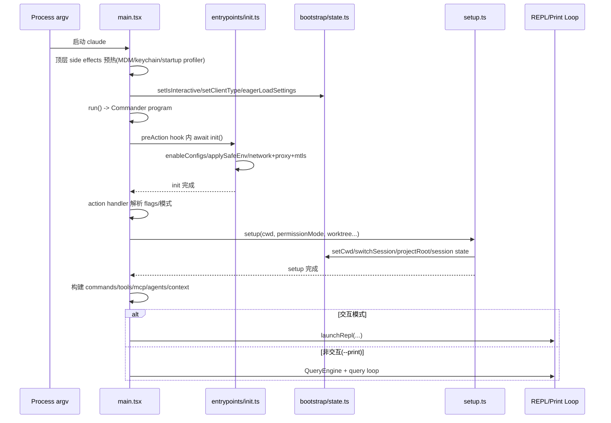
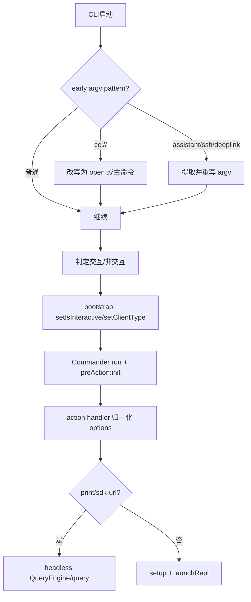

# 01. 入口与启动编排

## 范围
- `src/main.tsx`
- `src/setup.ts`
- `src/entrypoints/init.ts`
- `src/bootstrap/state.ts`
- `src/context.ts`

## 1) 启动架构总览
该 CLI 采用“**单入口超级编排器** + **可延迟初始化的基础设施层** + **全局会话状态中心**”模式：
- `main.tsx`：负责参数预处理、模式判定、Commander 命令树、action 执行主流程。
- `entrypoints/init.ts`：负责底层 runtime 初始化（配置、网络、证书、telemetry、cleanup、remote settings loading promise）。
- `setup.ts`：负责会话级初始化（cwd、hooks 快照、worktree/tmux、terminal backup 恢复、会话记忆初始化等）。
- `bootstrap/state.ts`：进程内单例状态仓（会话 ID、cwd/projectRoot、模型/预算/统计、feature latch、遥测对象、session-only flags）。
- `context.ts`：系统/用户 prompt 上下文构建（git snapshot、CLAUDE.md 注入、日期注入、cache breaker 注入）。

## 2) 启动时序图

## 3) 关键控制流
### 3.1 `main.tsx` 的编排职责
- 早期 argv 重写/短路：`cc://`、`assistant`、`ssh`、deep-link URI 等在真正 parse 前处理。
- 先判断交互/非交互，再设置 bootstrap 状态（如 `setIsInteractive`, `setClientType`），确保后续 init/telemetry 使用正确上下文。
- `run()` 内使用 Commander，`preAction` 中强制执行 `init()`，并完成：
  - 插件目录注入
  - migrations
  - remote managed settings/policy limits 非阻塞加载
  - sinks 初始化
- action handler 中做大量参数归一化与安全校验（permission mode、session id、system prompt file、worktree/tmux、sdk-url 自动格式切换等），最后分流到 REPL 或 headless。

### 3.2 `init.ts` 的初始化哲学
`init()`是 memoized 且幂等化导向，强调：
- **安全先行**：先 safe env，再 trust 后做 telemetry fully init。
- **并行/非阻塞**：诸多任务 fire-and-forget（OAuth cache、JetBrains 检测、repo 检测、1P logging init）。
- **fail-open 设计**：upstream proxy/remote settings 失败不阻断主流程。
- **资源清理可回收**：统一 register cleanup（LSP manager、session teams 等）。

### 3.3 `setup.ts` 的会话构建职责
`setup()`处理“会话级副作用”，核心点：
- Node 版本门禁（<18 直接退出）。
- UDS messaging server（条件开启）和 teammate snapshot（bare 模式禁用）。
- terminal/iTerm 备份恢复（仅交互会话）。
- 调用 `setCwd()` 后立刻 hooks snapshot + fileChanged watcher（强调顺序依赖）。
- 可选 worktree/tmux 创建，兼容 git 与 hook-only 非 git VCS 场景。

### 3.4 `bootstrap/state.ts` 的全局状态设计
是“**极厚状态内核**”：
- 既保存业务状态（model usage, costs, session ids），也保存基础设施状态（telemetry providers, prompt cache latches, remote/session flags）。
- 暴露大量 getter/setter，避免跨模块直接共享可变对象。
- 对 session 切换提供原子操作：`switchSession(sessionId, projectDir)`，保障 session ID 与 transcript 所在目录一致变更。
- 存在明显的“防止扩张提醒”（源码注释多次强调谨慎新增 global state）。

## 4) 启动模式分流图

## 5) 值得学习的实现写法
- 启动期性能优化：`main.tsx` 顶部 side effects 预热（profile checkpoint、MDM 读取、keychain 预取）在 import 图阶段并行执行。
- feature gate + require 实现 dead-code elimination：大量 `feature('X') ? require(...) : null` 写法，在构建与运行期双重裁剪。
- `preAction` 统一初始化（而不是每个命令手工做），保证命令行为一致性。
- “先 safe env 后 full env”的安全边界清晰，避免 untrusted 目录早期扩权。
- `switchSession` 绑定 sessionId 与 projectDir，避免 resume/跨工程时 transcript 漂移。

## 6) 风险与复杂度观察
- `main.tsx`、`REPL.tsx`、`PromptInput.tsx` 文件规模极大，属于“编排过载”风险点，后续维护依赖严格约定与注释纪律。
- `bootstrap/state.ts` 承载过多横切状态，虽然统一但也提高了耦合半径。
- 多模式（interactive/headless/remote/assistant/ssh）分流逻辑密集，需要高强度回归测试保障 flag 组合行为。

## 7) 证据文件
- `src/main.tsx`
- `src/setup.ts`
- `src/entrypoints/init.ts`
- `src/bootstrap/state.ts`
- `src/context.ts`
