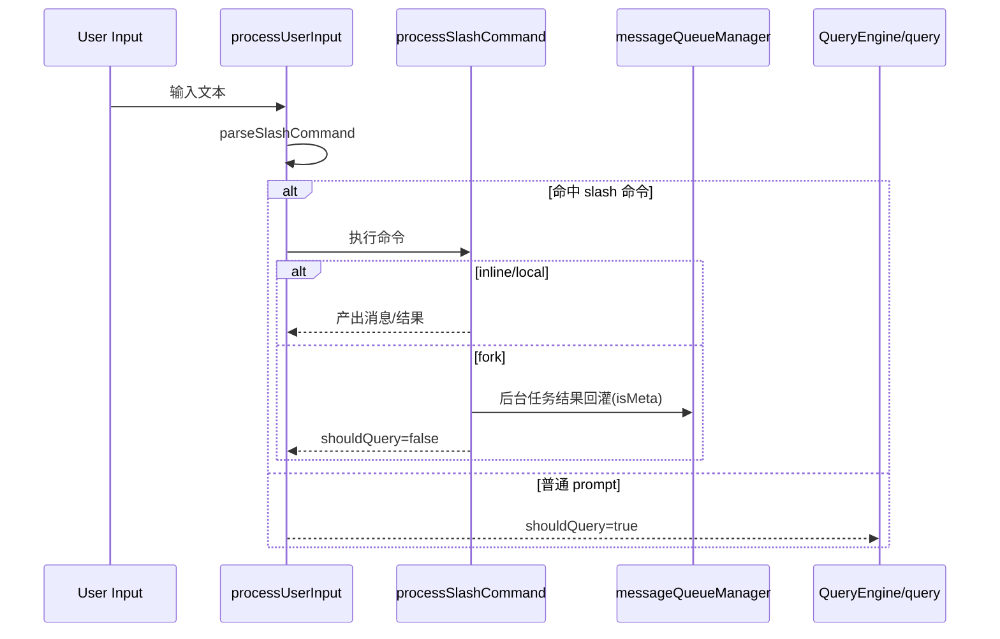

# 02. 命令系统（Slash Command + CLI Command）

## 范围
- `src/commands.ts`
- `src/types/command.ts`
- `src/utils/processUserInput/processUserInput.ts`
- `src/utils/processUserInput/processSlashCommand.tsx`
- `src/utils/messageQueueManager.ts`
- `src/cli/print.ts`

## 1) 命令系统总体设计
Claude Code 的命令体系是“双轨并存”：
- CLI 子命令轨：由 `main.tsx + commander` 驱动（如 `claude config`, `claude mcp`）。
- 会话内 Slash 轨：由 `processUserInput` 识别并执行（如 `/compact`, `/permissions`, 插件/skill 命令）。

核心设计目标：
- 统一抽象：命令都收敛到 `Command` 类型。
- 延迟加载：重命令通过 `load()` 或动态 `import()` 延迟进入热路径。
- 多来源融合：内置命令 + skills + plugins + MCP 命令统一进入候选集。
- 队列化执行：任何来源的输入/通知都进入统一队列按优先级调度。

## 2) 命令对象模型
`src/types/command.ts` 定义三类命令：
- `prompt`：产出 prompt 内容，触发模型回合。
- `local`：本地逻辑执行，返回文本/compact/skip。
- `local-jsx`：执行后渲染交互式 JSX UI。

关键字段（学习重点）：
- `availability`：控制可见/可用人群（例如 claude.ai / console）。
- `isEnabled/isHidden`：运行时开关与发现控制。
- `context: 'inline' | 'fork'`：skill 可在主会话或子代理执行。
- `immediate`：可绕过普通排队逻辑立即执行。

## 3) 组合与装配
`src/commands.ts` 做了三层装配：
1. 内置命令列表（含 feature gate 条件 require）。
2. 运行时加载动态命令（skills/plugins/MCP）。
3. 过滤策略（enabled/availability/bridge-safe/non-interactive 约束）。

一个关键实现点：
- 通过 `feature('...') ? require(...) : null` + memoize，减少冷启动体积并保持可测试性。

## 4) Slash 命令执行链

## 5) 统一消息队列模型
`src/utils/messageQueueManager.ts` 是核心调度器：
- 三档优先级：`now > next > later`。
- 队列统一容纳：用户输入、任务通知、系统注入消息、桥接消息。
- React 与非 React 共享：`useSyncExternalStore` 快照 + 非 UI 直接读 API。

这让 `REPL` 与 `print.ts`（headless/SDK）可以复用同一套“命令推进机制”。

## 6) Headless 中的命令排队执行
`src/cli/print.ts` 里，`drainCommandQueue` 持续拉取队列并处理：
- 批处理可合并命令（同轮处理，减少开销）。
- 与 structured I/O、远程控制、权限响应联动。
- 通过 command lifecycle 事件上报 consumed/completed，保证 SDK/remote 端状态一致。

## 7) 设计亮点（值得学习）
- 命令即能力插件：统一协议 + 延迟加载，天然适配插件生态。
- 队列化把“交互输入”和“系统异步事件”统一处理，避免多路并发状态错乱。
- forked slash command 的“后台执行 + 结果回灌”设计，避免主线程串行阻塞。

## 8) 风险与复杂度
- `commands.ts` 集合过大（众多 feature gate）导致可读性与变更风险上升。
- `print.ts` 同时承担 SDK 协议、命令队列、MCP 控制，职责非常重。
- 多种命令来源（builtin/plugin/skill/mcp）叠加后，冲突处理和可观测性要求高。

## 9) 证据文件
- `src/commands.ts`
- `src/types/command.ts`
- `src/utils/processUserInput/processUserInput.ts`
- `src/utils/processUserInput/processSlashCommand.tsx`
- `src/utils/messageQueueManager.ts`
- `src/cli/print.ts`
