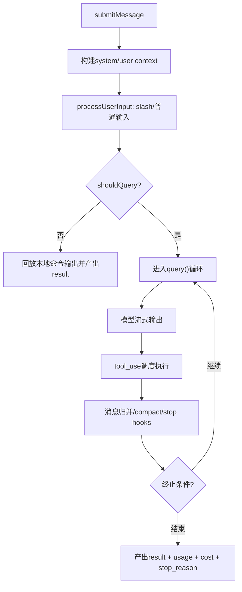

# 03. 查询引擎与会话循环（QueryEngine + query loop）

## 范围
- `src/QueryEngine.ts`
- `src/query.ts`
- `src/query/config.ts`
- `src/query/deps.ts`
- `src/query/tokenBudget.ts`
- `src/query/stopHooks.ts`

## 1) 核心职责
`QueryEngine` 是 headless/SDK 路径的“会话内核”：
- 管理会话消息状态（`mutableMessages`）与跨 turn 状态（usage、permission denials、file cache）。
- 将用户输入转换为可执行 turn（含 slash command 预处理）。
- 驱动 `query()` 主循环并把内部消息流映射为 SDK 消息。
- 负责 transcript 持久化时机与 resumability 保证。

## 2) 主流程图

## 3) QueryEngine 的关键设计
- 会话持久化前置：用户消息先写 transcript，再进入 API 回合，避免“请求未返回即中断导致无法 resume”。
- 两阶段 `processUserInputContext`：先允许 slash 命令改写消息，再以更新后的 model/messages 重建上下文进入 query。
- 状态封装：`discoveredSkillNames`、`loadedNestedMemoryPaths`、permission denial 统计等都绑定在引擎实例内。

## 4) query.ts 状态机特征
`query.ts` 用生成器实现“事件流状态机”：
- 输入：messages/systemPrompt/canUseTool/toolUseContext 等。
- 输出：`StreamEvent | Message | RequestStartEvent | TombstoneMessage`。
- 内部状态包含：turnCount、max_output_tokens 恢复计数、autoCompact 跟踪、pending tool summary。

这使它天然支持：
- 流式 UI（边到达边消费）。
- SDK 消费（统一事件协议）。
- 错误恢复分支（max_output_tokens、prompt-too-long、fallback model）。

## 5) 工具执行与循环耦合点
query loop 的关键闭环：
1. assistant 产出 `tool_use`。
2. tool orchestration 执行并生成 `tool_result` user message。
3. 结果消息回注入消息序列，进入下一次模型采样。

同时还叠加：
- stop hooks
- microcompact/autocompact
- token budget 自动 continue/stop 决策

## 6) Token Budget 子系统
`query/tokenBudget.ts` 负责“预算内继续推进”的策略：
- 跟踪 continuation 次数与增量 token 收益。
- 达到完成阈值前自动追加 nudge continuation。
- 若收益递减则停止（避免低收益空转）。

## 7) 依赖注入与可测试性
`query/deps.ts` 将关键外部依赖抽为 `QueryDeps`：
- 模型调用
- autocompact/microcompact
- uuid 生成

这是“在复杂生成器里提高可测试性”的典型写法：避免大量模块级 spy。

## 8) 值得学习的实现点
- 事件流 + 状态机解耦：query 不关心 UI，只关心“可消费事件”。
- 持久化时机严格控制：transcript 写入点设计有很强工程经验。
- 回退策略分层：网络重试、模型 fallback、上下文 compact 各自独立但可串联。

## 9) 风险点
- `QueryEngine.ts` 和 `query.ts` 均属超长关键文件，跨特性分支非常多。
- feature gate 与运行时策略大量叠加，回归测试覆盖压力大。

## 10) 证据文件
- `src/QueryEngine.ts`
- `src/query.ts`
- `src/query/deps.ts`
- `src/query/tokenBudget.ts`
- `src/query/stopHooks.ts`
