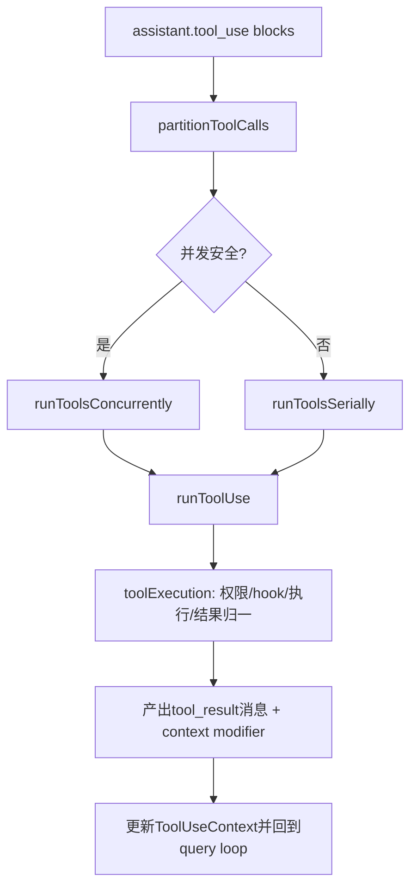

# 04. Tool 框架与工具调度

## 范围
- `src/Tool.ts`
- `src/tools.ts`
- `src/services/tools/toolOrchestration.ts`
- `src/services/tools/toolExecution.ts`
- `src/services/tools/StreamingToolExecutor.ts`
- `src/utils/toolPool.ts`

## 1) Tool 抽象核心
`Tool.ts` 定义了 Claude Code 的工具执行契约：
- 输入 schema（zod）
- 执行函数
- 并发安全声明 `isConcurrencySafe`
- 中断语义 `interruptBehavior`
- 权限决策上下文 `ToolUseContext`

`ToolUseContext` 不是轻量对象，而是“运行时操作系统”：
- appState 读写
- abort controller
- UI 渲染回调（setToolJSX）
- hook/notification/SDK status
- file cache、memory triggers、attribution/file history 更新

## 2) 工具池装配
`src/tools.ts` 负责：
- 全部工具注册（feature gate + 环境条件）
- preset（如 default）
- deny rule 预过滤（在模型看到工具前就裁剪）
- simple/repl/coordinator/worktree 等模式下的工具集合收敛

这一步决定“模型看到什么工具”，属于安全与性能前置边界。

## 3) 调度流程图

## 4) 两种执行器
- `toolOrchestration.ts`：按 batch（并发安全 vs 非并发安全）组织执行，适合普通非流式路径。
- `StreamingToolExecutor.ts`：边到达边执行，支持流式工具调用；处理 sibling error 级联取消、streaming fallback 丢弃等复杂场景。

## 5) toolExecution 的关键职责
`toolExecution.ts` 叠加了大量横切逻辑：
- 权限判定 + hook 预后置
- telemetry/span 计量
- MCP 工具细节处理与认证错误归类
- 结果规范化（tool_result block、错误映射、内存修正提示）

它本质是“工具调用中间件总线”。

## 6) 工具并发策略
- 并发工具必须通过 schema parse 且 `isConcurrencySafe(input)` 返回 true。
- 非并发工具按顺序串行，避免共享资源竞争（文件写、shell副作用）。
- 执行中维护 in-progress tool IDs，用于 UI/中断状态同步。

## 7) 值得学习的点
- 通过工具元数据声明并发/中断能力，而不是硬编码在调度器里。
- 运行时上下文（ToolUseContext）统一传递，避免全局 mutable 杂散访问。
- streaming executor 提供“即时反馈 + 顺序保证 + 失败隔离”的平衡。

## 8) 风险点
- `ToolUseContext` 字段极多，演进容易造成隐式耦合。
- 工具执行路径横切逻辑很多（权限、hooks、telemetry、MCP），调试复杂。

## 9) 证据文件
- `src/Tool.ts`
- `src/tools.ts`
- `src/services/tools/toolOrchestration.ts`
- `src/services/tools/toolExecution.ts`
- `src/services/tools/StreamingToolExecutor.ts`
- `src/utils/toolPool.ts`
