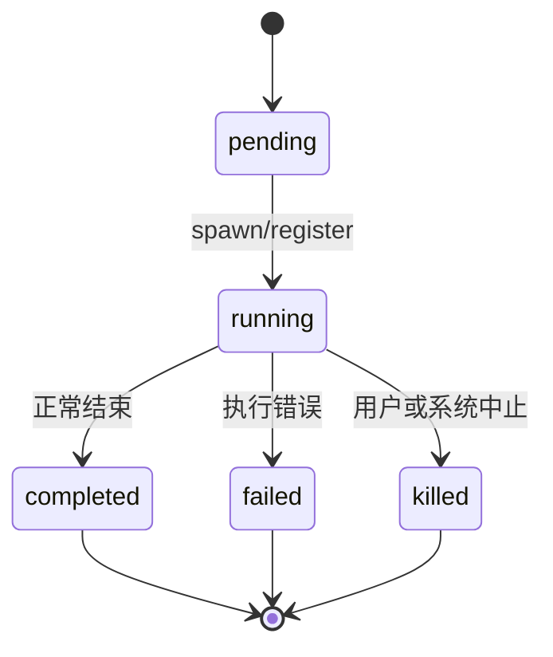

# 05. Task 框架与后台任务

## 范围
- `src/Task.ts`
- `src/tasks.ts`
- `src/tasks/types.ts`
- `src/tasks/LocalShellTask/LocalShellTask.tsx`
- `src/tasks/LocalAgentTask/LocalAgentTask.tsx`
- `src/tasks/RemoteAgentTask/RemoteAgentTask.tsx`
- `src/tasks/DreamTask/DreamTask.ts`

## 1) Task 模型
`Task.ts` 定义统一任务域：
- `TaskType`: local_bash / local_agent / remote_agent / in_process_teammate / local_workflow / monitor_mcp / dream
- `TaskStatus`: pending/running/completed/failed/killed
- `TaskStateBase`: 统一字段（id、outputFile、offset、notified、start/endTime）

任务 ID 有前缀分型（b/a/r/t/w/m/d），便于日志与 UI 快速识别。

## 2) 调度与注册
`tasks.ts` 通过 `getAllTasks()` 按 feature gate 组装任务实现，和 tools.ts 思路一致。

任务状态存放在 `AppState.tasks`，由 `registerTask/updateTaskState` 等框架函数集中管理。

## 3) 任务生命周期图

## 4) LocalShellTask
核心特点：
- ShellCommand + TaskOutput 结合，后台执行与输出落盘。
- 启动 stall watchdog：检测“输出停滞 + 疑似交互提示”并向主队列发通知。
- 完成后统一发 task-notification（带 task_id/status/output_file）。

## 5) LocalAgentTask
核心特点：
- 代表本地子代理任务（Agent tool 派生）。
- 维护 progress tracker（toolUseCount/tokenCount/recentActivities）。
- 支持 foreground/background 切换、retain 机制、盘上 transcript 补载。

## 6) RemoteAgentTask
核心特点：
- 远程 session 轮询（`pollRemoteSessionEvents`）并解析状态。
- sidecar metadata 持久化，支持 resume 后恢复远程任务追踪。
- 特化场景（ultraplan/ultrareview/autofix-pr）有独立通知与完成判定路径。

## 7) DreamTask
这是“UI可见化的自动记忆整理子任务”：
- 状态轻量，但会记录 phase/filesTouched/turns。
- 主要用于让后台 memory consolidation 对用户可见。

## 8) 值得学习的点
- TaskOutput 文件路径统一，让长任务输出消费与恢复更稳定。
- 通知机制通过队列回灌，避免任务线程直接操作主会话消息。
- 远程任务恢复（metadata sidecar）是典型“最终一致性”工程写法。

## 9) 风险点
- LocalAgent/RemoteAgent 任务状态字段繁多，状态转换必须严格约束。
- 任务通知 XML-like tag 协议依赖较强，需保持兼容。

## 10) 证据文件
- `src/Task.ts`
- `src/tasks.ts`
- `src/tasks/LocalShellTask/LocalShellTask.tsx`
- `src/tasks/LocalAgentTask/LocalAgentTask.tsx`
- `src/tasks/RemoteAgentTask/RemoteAgentTask.tsx`
- `src/tasks/DreamTask/DreamTask.ts`
