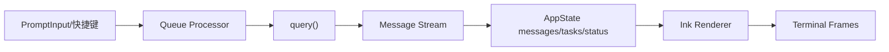

# 06. 状态管理与 REPL 交互渲染

## 范围
- `src/state/store.ts`
- `src/state/AppStateStore.ts`
- `src/state/onChangeAppState.ts`
- `src/screens/REPL.tsx`
- `src/components/App.tsx`
- `src/ink/ink.tsx`
- `src/ink.ts`

## 1) 状态层结构
- 基础 store：`createStore`（订阅、原子 setState、onChange side effects）。
- 业务状态模型：`AppState`（工具权限、任务、MCP、插件、UI、远程桥接、teammate 等）。
- 状态副作用统一入口：`onChangeAppState`（模式同步、配置持久化、缓存清理、环境变量重应用）。

## 2) REPL 是交互编排中心
`REPL.tsx` 集成了：
- 输入、队列、query loop、消息渲染
- hook 生命周期
- MCP/IDE/桥接/远程会话
- 权限弹窗、任务面板、通知系统

它是“UI 层 orchestrator”，而不是纯展示组件。

## 3) 交互数据流

## 4) Ink 渲染引擎特点
`src/ink/ink.tsx` 是自研终端渲染框架核心：
- 基于 React Reconciler + Yoga 布局。
- 双帧缓冲、patch 输出、alt-screen 管理。
- 鼠标/键盘/selection/search highlight/光标声明等终端特性完备。

这部分工程强度很高，已接近小型 TUI runtime。

## 5) 状态变更副作用模式（关键）
`onChangeAppState` 采用“单闸门”方式处理横切同步：
- permission mode 改变 => 同步 session metadata + SDK 通知。
- mainLoopModel 改变 => 同步 settings 与 bootstrap override。
- settings 改变 => 清 auth cache + 重新注入 env。

该模式减少了“到处手动发事件”的一致性问题。

## 6) 值得学习的点
- 通过最小 store + 明确 onChange 边界，实现复杂状态的可控副作用。
- REPL 与 headless 共享大量底层能力（queue/query/tool/task），避免双栈分裂。
- Ink 层将终端高级交互（selection/alt-screen/IME）做成基础设施，不散落在业务组件里。

## 7) 风险点
- `REPL.tsx` 文件过大，职责过重。
- `AppState` 字段非常广，演进必须保持 schema 与 side effect 同步。

## 8) 证据文件
- `src/state/store.ts`
- `src/state/AppStateStore.ts`
- `src/state/onChangeAppState.ts`
- `src/screens/REPL.tsx`
- `src/components/App.tsx`
- `src/ink/ink.tsx`
- `src/ink.ts`
