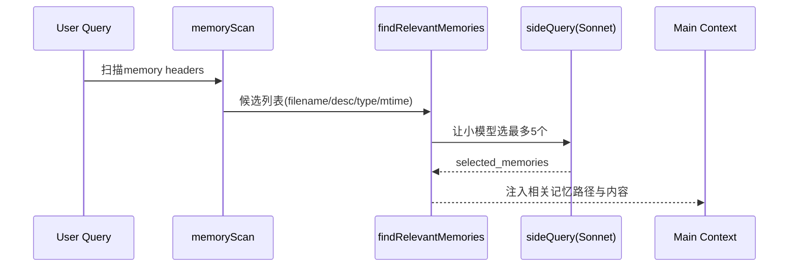

# 07. 上下文与记忆系统

## 范围
- `src/context.ts`
- `src/utils/claudemd.ts`
- `src/memdir/memdir.ts`
- `src/memdir/findRelevantMemories.ts`
- `src/memdir/memoryScan.ts`
- `src/services/SessionMemory/sessionMemory.ts`

## 1) 两层上下文
- System Context（`getSystemContext`）：git snapshot、cache breaker、系统注入。
- User Context（`getUserContext`）：CLAUDE.md 体系、当前日期、记忆注入。

二者均 memoize，按会话缓存。

## 2) CLAUDE.md 发现与注入
`utils/claudemd.ts` 负责：
- 多层级规则文件发现（managed/user/project/local）。
- `@include` 展开、frontmatter paths 解析。
- 文本类型白名单与大小限制。

本质是“指令文件系统 + 注入管线”。

## 3) Memory Directory 设计
`memdir/memdir.ts` 的核心理念：
- 记忆是文件系统（`MEMORY.md` 索引 + topic 文件），不是黑盒数据库。
- 强约束写法（frontmatter、类型分类、索引长度与字节上限）。
- 自动保证 memory 目录存在，减少模型无效探测。

## 4) 相关记忆召回流程

## 5) Session Memory（会话内自动笔记）
`services/SessionMemory/sessionMemory.ts`：
- 在阈值达成时后台 fork 子代理提炼会话记忆。
- 维护 `lastMemoryMessageUuid` 与 token/tool-call 双阈值。
- 自动初始化 session memory 文件并按模板更新。

这个机制是“长会话可持续性”的关键补丁。

## 6) 值得学习的点
- 记忆系统以 markdown 文件为第一公民，可审计、可迁移、可手工修复。
- 召回分两步：先 cheap scan，再小模型选择，控制 token 成本。
- Session Memory 与长期 memory 分层，避免污染。

## 7) 风险点
- 记忆注入链路较长（CLAUDE.md + memdir + session memory），需要防重复与大小失控。
- include/frontmatter/path-glob 规则复杂，配置错误易导致意外注入或缺失。

## 8) 证据文件
- `src/context.ts`
- `src/utils/claudemd.ts`
- `src/memdir/memdir.ts`
- `src/memdir/findRelevantMemories.ts`
- `src/memdir/memoryScan.ts`
- `src/services/SessionMemory/sessionMemory.ts`
