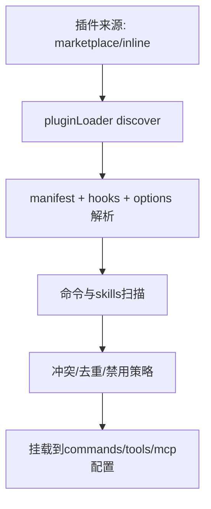

# 08. MCP + 插件 + Skills 生态

## 范围
- `src/services/mcp/client.ts`
- `src/services/mcp/config.ts`
- `src/services/mcp/auth.ts`
- `src/services/mcp/MCPConnectionManager.tsx`
- `src/utils/plugins/pluginLoader.ts`
- `src/utils/plugins/loadPluginCommands.ts`
- `src/skills/loadSkillsDir.ts`
- `src/plugins/bundled/index.ts`

## 1) 生态层目标
该层把“外部能力”统一接入到 CLI：
- MCP：外部工具/资源/提示协议。
- 插件：本地或市场分发扩展（commands/agents/hooks）。
- Skills：markdown 定义的命令型能力，可 inline 或 fork。

## 2) MCP 客户端架构
`services/mcp/client.ts` 支持多 transport：
- stdio
- SSE
- streamable HTTP
- WebSocket
- SDK control transport

并负责：
- server 连接生命周期
- tool/resource/prompt 拉取
- MCP 工具封装为本地 Tool
- OAuth 认证与失效恢复（`auth.ts`）

## 3) MCP 配置分层
`config.ts` 聚合来源：
- managed / user / project / local / dynamic
- plugin 导入的 MCP server

并提供去重与签名机制（command/url signature），避免重复连接相同 server。

## 4) 插件加载流程

## 5) Skills 加载与解析
`skills/loadSkillsDir.ts` 负责：
- 按 source（policy/user/project/plugin/bundled）加载。
- frontmatter 解析：allowed-tools、effort、context(fork)、hooks、paths。
- token 估算与显示信息构建。

与 plugin 命令加载器共享类似的 markdown/frontmatter 驱动模式。

## 6) 连接管理 UI 层
`MCPConnectionManager.tsx` 提供 React context：
- `reconnectMcpServer`
- `toggleMcpServer`

把 MCP 动态连接控制暴露给 REPL UI。

## 7) 值得学习的点
- 生态能力并非“外挂”，而是内建统一抽象（最终都映射到 Command/Tool）。
- 配置与连接层分离：配置解析是静态，连接建立是运行时。
- OAuth 细节、错误归类、会话过期处理做得很工程化。

## 8) 风险点
- 多来源配置合并 + 去重逻辑复杂，容易出现边界冲突。
- MCP transport/鉴权路径多样，故障定位成本高。

## 9) 证据文件
- `src/services/mcp/client.ts`
- `src/services/mcp/config.ts`
- `src/services/mcp/auth.ts`
- `src/services/mcp/MCPConnectionManager.tsx`
- `src/utils/plugins/pluginLoader.ts`
- `src/utils/plugins/loadPluginCommands.ts`
- `src/skills/loadSkillsDir.ts`
- `src/plugins/bundled/index.ts`
