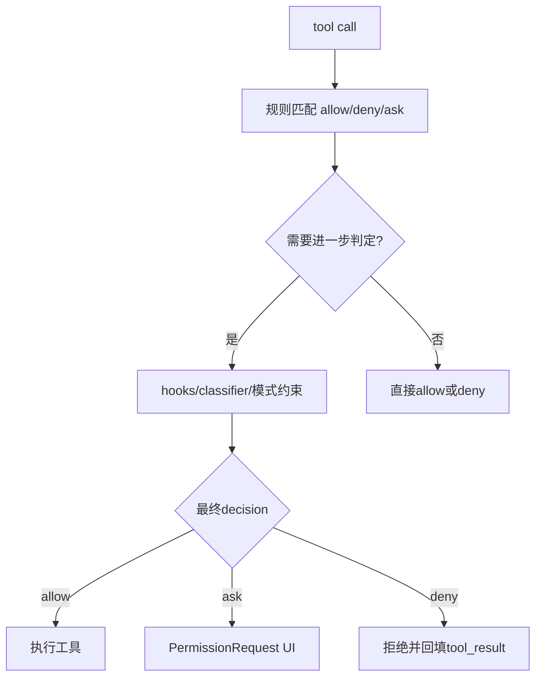

# 09. 权限系统与沙箱边界

## 范围
- `src/utils/permissions/permissionSetup.ts`
- `src/utils/permissions/permissions.ts`
- `src/utils/permissions/PermissionMode.ts`
- `src/utils/permissions/yoloClassifier.ts`
- `src/components/permissions/PermissionRequest.tsx`
- `src/components/sandbox/SandboxConfigTab.tsx`
- `src/utils/sandbox/sandbox-adapter.ts`

## 1) 三层安全模型
1. 规则层：allow/deny/ask 规则与 mode（default/plan/acceptEdits/bypass/dontAsk/auto）。
2. 判定层：`permissions.ts` 进行规则匹配、子命令拆分、classifier/hook 介入。
3. 执行层：sandbox runtime 将权限落实到文件/网络系统边界。

## 2) 权限判定流程图

## 3) permissionSetup 的职责
`permissionSetup.ts` 做“初始策略构建”与模式切换约束：
- 从 settings + CLI 参数装配工具权限上下文。
- 识别危险规则（例如 Bash 通配、PowerShell 高危执行、Agent allow）。
- 自动模式（auto）启用前进行安全条件检查。

## 4) permissions.ts 的职责
- 统一规则解释与匹配（含 MCP 前缀规则）。
- 生成权限请求消息。
- 承接 classifier/hook 结果，形成最终 `PermissionResult`。
- 对 subcommand 场景做细粒度结果合并。

## 5) Auto-mode 分类器
`yoloClassifier.ts` 实现 auto 模式安全阀：
- 基于 prompt + action 构造 sideQuery 分类请求。
- 支持规则模板与用户覆盖。
- 失败时可输出调试转储，便于会话级诊断。

## 6) 沙箱适配层
`sandbox-adapter.ts` 将 Claude 配置映射到 sandbox-runtime：
- 路径规则转换（`//`、`/`、相对路径、`~`）
- 网络域名 allow/deny
- 设置文件与关键目录写保护
- 工作目录、附加目录、git 特殊路径处理

## 7) 权限 UI 层
`PermissionRequest.tsx` 按工具类型分派不同确认组件：
- Bash/Edit/Write/Skill/PlanMode/Monitor 等独立交互面板。
- 支持 sticky footer（长内容批准场景）。

## 8) 值得学习的点
- 安全策略前置到“模型可见工具集”与“执行前判定”两层，降低误用风险。
- 权限模式、规则系统、沙箱系统三者不是替代关系，而是叠加防线。
- auto mode classifier 与人工确认可以混合，兼顾效率与安全。

## 9) 风险点
- 权限规则语法灵活，错误配置可能引入放权过度。
- 分类器与 hooks 的时序复杂，必须有完备观测与回归测试。

## 10) 证据文件
- `src/utils/permissions/permissionSetup.ts`
- `src/utils/permissions/permissions.ts`
- `src/utils/permissions/PermissionMode.ts`
- `src/utils/permissions/yoloClassifier.ts`
- `src/components/permissions/PermissionRequest.tsx`
- `src/components/sandbox/SandboxConfigTab.tsx`
- `src/utils/sandbox/sandbox-adapter.ts`
