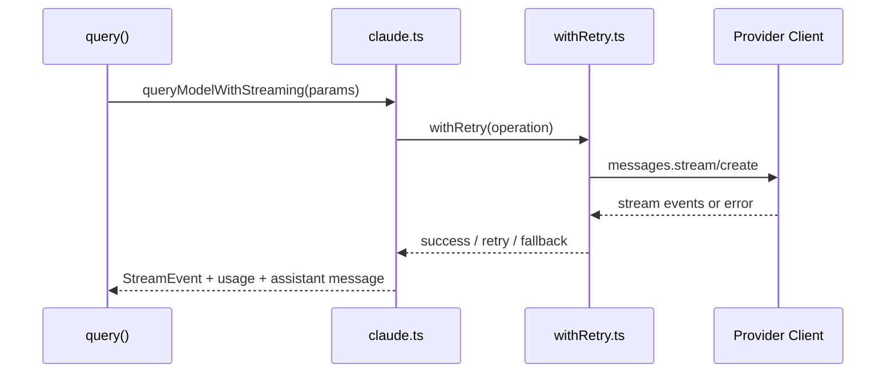

# 10. API / 模型 / 预算 / 压缩体系

## 范围
- `src/services/api/claude.ts`
- `src/services/api/client.ts`
- `src/services/api/withRetry.ts`
- `src/services/compact/compact.ts`
- `src/services/compact/autoCompact.ts`
- `src/services/compact/microCompact.ts`
- `src/services/compact/sessionMemoryCompact.ts`

## 1) API 层职责分离
- `client.ts`：提供不同 provider 客户端初始化（Anthropic/Bedrock/Foundry/Vertex）与认证材料装配。
- `claude.ts`：构建请求参数、流式响应处理、usage/cost 累计、beta headers 与能力开关。
- `withRetry.ts`：统一重试策略（429/529、连接错误、fallback model、持久化重试模式）。

## 2) 请求执行链

## 3) 模型能力与 Header 策略
`claude.ts` 会根据模型与环境动态决定：
- thinking / effort / structured output / task budget 等特性头。
- prompt cache scope 与缓存策略。
- deferred tools / mcp instruction delta 等优化策略。

整体风格是“能力检测后装配”，而非固定模板。

## 4) Context 压缩体系（三层）
1. `microCompact`：细粒度清理旧工具结果，压缩历史负担。
2. `autoCompact`：阈值触发自动 compact，对话摘要化。
3. `compact`：完整 compact 执行器（含 pre/post hooks、恢复附件、边界消息）。

并扩展了 `sessionMemoryCompact` 作为实验型策略。

## 5) autoCompact 决策逻辑
`autoCompact.ts` 核心概念：
- 有效窗口 = contextWindow - summary预留输出。
- 多阈值（warning/error/autocompact/blocking）。
- 连续失败熔断，避免“无效 compact 风暴”。
- 对特定 querySource 禁止递归 compact（如 compact/session_memory 自身）。

## 6) microCompact 的工程价值
`microCompact.ts` 专注“便宜且频繁”的收缩：
- 针对特定工具结果做清理与占位替换。
- 支持 cached microcompact 状态与 cache edits 重放。
- 减少长期对话中工具产出的 token 滞留。

## 7) 值得学习的点
- Provider 差异被封装在 client 层，query 层保持统一接口。
- 重试、fallback、压缩都作为独立模块，可组合而非硬耦合。
- 压缩并非单点策略，而是多层次策略叠加（实时/阈值/完整摘要）。

## 8) 风险点
- API 能力开关与 beta header 组合复杂，兼容性维护成本高。
- 压缩策略并行演进时，容易出现摘要质量与上下文一致性回归。

## 9) 证据文件
- `src/services/api/claude.ts`
- `src/services/api/client.ts`
- `src/services/api/withRetry.ts`
- `src/services/compact/compact.ts`
- `src/services/compact/autoCompact.ts`
- `src/services/compact/microCompact.ts`
- `src/services/compact/sessionMemoryCompact.ts`
