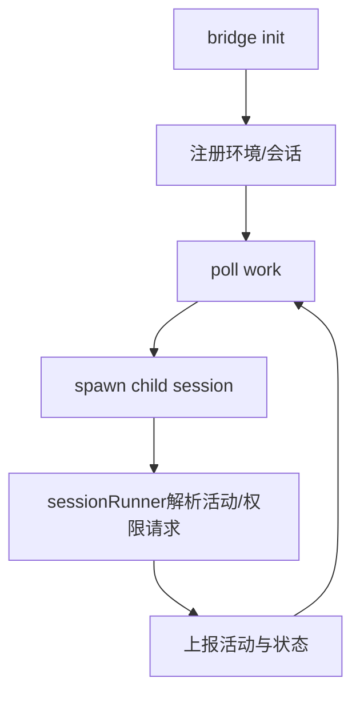

# 11. 远程 / Bridge / 多端连接架构

## 范围
- `src/bridge/bridgeMain.ts`
- `src/bridge/replBridge.ts`
- `src/bridge/sessionRunner.ts`
- `src/remote/RemoteSessionManager.ts`
- `src/remote/SessionsWebSocket.ts`
- `src/server/directConnectManager.ts`
- `src/upstreamproxy/upstreamproxy.ts`

## 1) 远程能力分层
- Bridge（`bridge/*`）：把本地 CLI 会话注册到远端环境并维护工作分发。
- Remote Session（`remote/*`）：订阅远程会话消息并回传用户输入/权限响应。
- Direct Connect（`server/*`）：直接 ws 管道模式。
- Upstream Proxy（`upstreamproxy/*`）：容器侧代理与证书注入。

## 2) Bridge 工作流图

## 3) Bridge 关键机制
- `bridgeMain.ts`：poll/backoff/session lifecycle 主循环，处理超时、重连、session token 更新。
- `replBridge.ts`：REPL 侧桥接核心，转发 messages/control requests。
- `sessionRunner.ts`：子进程 NDJSON 解析，抽取 tool activity、first user message、permission requests。

## 4) RemoteSessionManager + SessionsWebSocket
- `RemoteSessionManager` 负责协议编排：SDK 消息、control_request/control_response/cancel。
- `SessionsWebSocket` 负责连接层：鉴权头、心跳、重连、永久 close code 判定。

两者分离让传输层与业务层职责清晰。

## 5) Direct Connect
`directConnectManager.ts` 提供轻量直连：
- 连接单个 ws endpoint。
- 直接收发 SDK/control 消息。
- 用于特定部署模式下的简化链路。

## 6) Upstream Proxy 设计
`upstreamproxy.ts` 负责容器内代理基础设施：
- 读取 session token
- 设置 non-dumpable
- 拉取 CA bundle
- 启动本地 relay
- 暴露 HTTPS_PROXY/SSL_CERT_FILE 环境

强调 fail-open：任何一步失败都不应阻断主会话。

## 7) 值得学习的点
- 远程体系严格区分“会话编排、传输连接、子进程执行、代理注入”四层。
- control request/response 协议贯穿本地与远端，权限交互一致。
- 重连/backoff/永久错误码处理较成熟，适合长期连接场景。

## 8) 风险点
- 多链路并存（bridge、remote ws、direct connect、upstream proxy），排障路径较长。
- session ID 兼容层（infra/compat）变更需格外谨慎。

## 9) 证据文件
- `src/bridge/bridgeMain.ts`
- `src/bridge/replBridge.ts`
- `src/bridge/sessionRunner.ts`
- `src/remote/RemoteSessionManager.ts`
- `src/remote/SessionsWebSocket.ts`
- `src/server/directConnectManager.ts`
- `src/upstreamproxy/upstreamproxy.ts`
