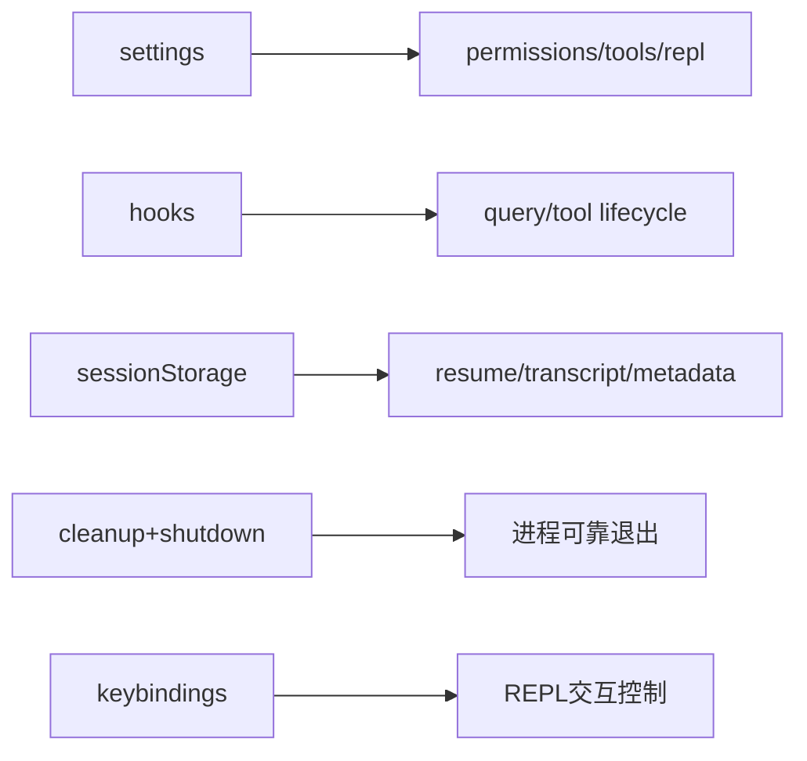

# 12. 支撑基建与横切能力

## 范围
- `src/utils/hooks.ts`
- `src/utils/settings/settings.ts`
- `src/utils/settings/changeDetector.ts`
- `src/utils/sessionStorage.ts`
- `src/utils/cleanupRegistry.ts`
- `src/utils/gracefulShutdown.ts`
- 及 `utils/`、`hooks/`、`keybindings/`、`constants/` 等横切模块

## 1) 横切能力地图

## 2) Settings 系统
`settings.ts` + `changeDetector.ts` 形成完整配置基建：
- 多来源合并（policy/user/project/local/flag/managed drop-ins）。
- schema 校验 + 兼容迁移。
- 实时监听与变更广播（含删除重建窗口、内部写过滤）。

## 3) Hooks 系统
`hooks.ts` 是一个完整生命周期事件引擎：
- pre/post tool use、session start/end、stop hooks、prompt submit 等。
- 支持 shell/http/agent hook、异步后台执行、超时控制、结果回流。
- 与 telemetry、task output、message queue 深度耦合。

## 4) Session Storage
`sessionStorage.ts` 负责：
- transcript JSONL 持久化
- 会话恢复读取、链路修复、元数据 sidecar
- agent transcript、queue operation、attribution/file-history 快照

这是 resume 能力与会话可追溯性的根基。

## 5) 退出与资源清理
- `cleanupRegistry.ts`：全局 cleanup 函数注册与批量执行。
- `gracefulShutdown.ts`：终端模式恢复、hook/analytics 收尾、resume hint、强制退出兜底。

该设计显著降低终端状态损坏与数据丢失风险。

## 6) 值得学习的点
- 横切系统普遍采用“集中入口 + 明确生命周期”的写法，避免隐式副作用散落。
- 变更监听（settings）与清理管理（cleanup）都是可复用的基础设施模式。

## 7) 风险点
- 横切模块彼此依赖广，循环依赖风险高（源码内已有不少 lazy import 规避）。
- 任何基建层回归会在多个业务面爆发，测试覆盖必须以“系统行为”而非单函数为主。

## 8) 证据文件
- `src/utils/hooks.ts`
- `src/utils/settings/settings.ts`
- `src/utils/settings/changeDetector.ts`
- `src/utils/sessionStorage.ts`
- `src/utils/cleanupRegistry.ts`
- `src/utils/gracefulShutdown.ts`
