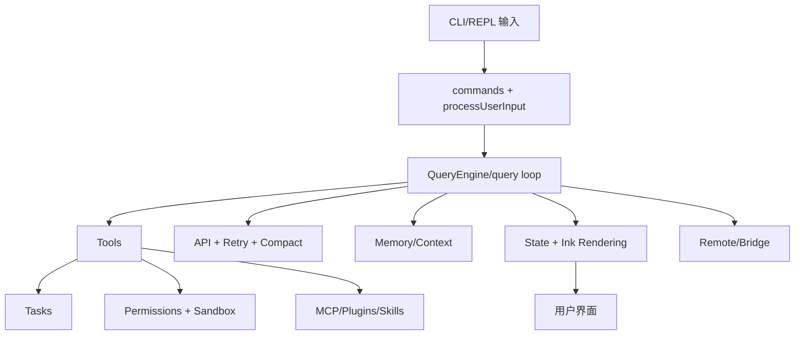

# 13. 全量 `src/` 覆盖校验与索引

> 统计基于当前仓库 `src/` 实际文件扫描，不依赖仓库文档。

## 1) 覆盖结论
- `src/` 总文件数：**1902**
- 已按架构模块完成 01–12 分层分析。
- 该索引用于“防漏看”与后续二次深入。

## 2) 顶层目录规模（按文件数）

| 目录 | 文件数 |
|---|---:|
| `utils` | 564 |
| `components` | 389 |
| `commands` | 207 |
| `tools` | 184 |
| `services` | 130 |
| `hooks` | 104 |
| `ink` | 96 |
| `bridge` | 31 |
| `constants` | 21 |
| `skills` | 20 |
| `cli` | 19 |
| `keybindings` | 14 |
| `tasks` | 12 |
| `migrations` | 11 |
| `types` | 11 |
| `context` | 9 |
| `entrypoints` | 8 |
| `memdir` | 8 |
| `state` | 6 |
| `buddy` | 6 |
| 其他单/少文件模块 | 若干 |

## 3) 关键子系统热点（按子目录体量）

| 子目录 | 文件数 | 说明 |
|---|---:|---|
| `components/permissions` | 51 | 权限交互 UI 族（不同 tool 的审批面板） |
| `components/messages` | 41 | 消息渲染与消息级组件体系 |
| `utils/plugins` | 44 | 插件发现、安装、缓存、市场、命令加载 |
| `utils/permissions` | 24 | 权限规则、classifier、mode、更新策略 |
| `utils/bash` | 23 | Bash 解析与命令安全辅助 |
| `utils/swarm` | 22 | 多代理/协作场景辅助能力 |
| `tools/AgentTool` | 20 | 子代理工具核心 |
| `tools/BashTool` | 18 | Bash 工具实现与权限联动 |
| `services/mcp` | 23 | MCP 客户端/配置/认证/连接管理 |
| `services/api` | 20 | API 客户端、流式请求、usage、错误处理 |
| `services/compact` | 11 | 上下文压缩/自动压缩/microcompact |

## 4) 建议学习顺序（从“能跑”到“能扩展”）
1. `main.tsx` / `setup.ts` / `entrypoints/init.ts`（启动与模式分流）
2. `commands.ts` + `processUserInput`（用户输入如何进入系统）
3. `QueryEngine.ts` + `query.ts`（主回合循环）
4. `Tool.ts` + `tools.ts` + `services/tools/*`（能力执行）
5. `Task.ts` + `tasks/*`（异步任务）
6. `state/*` + `REPL.tsx` + `ink/*`（交互运行时）
7. `context.ts` + `claudemd.ts` + `memdir/*`（上下文与记忆）
8. `services/mcp/*` + `utils/plugins/*` + `skills/*`（生态扩展）
9. `utils/permissions/*` + `sandbox-adapter.ts`（安全边界）
10. `services/api/*` + `services/compact/*`（性能与成本）

## 5) 交互大图（总览）

## 6) 与本学习文档的映射
- 启动编排：`01-*`
- 命令系统：`02-*`
- 查询循环：`03-*`
- 工具框架：`04-*`
- 任务框架：`05-*`
- 状态与渲染：`06-*`
- 上下文记忆：`07-*`
- MCP/插件/skills：`08-*`
- 权限与沙箱：`09-*`
- API/预算/压缩：`10-*`
- 远程桥接：`11-*`
- 横切基建：`12-*`

## 7) 说明
- 本索引用于覆盖校验与导航；具体实现细节请对应章节证据文件。
- 结论均来自 `src/` 代码阅读，不依赖仓库内既有分析文档。
