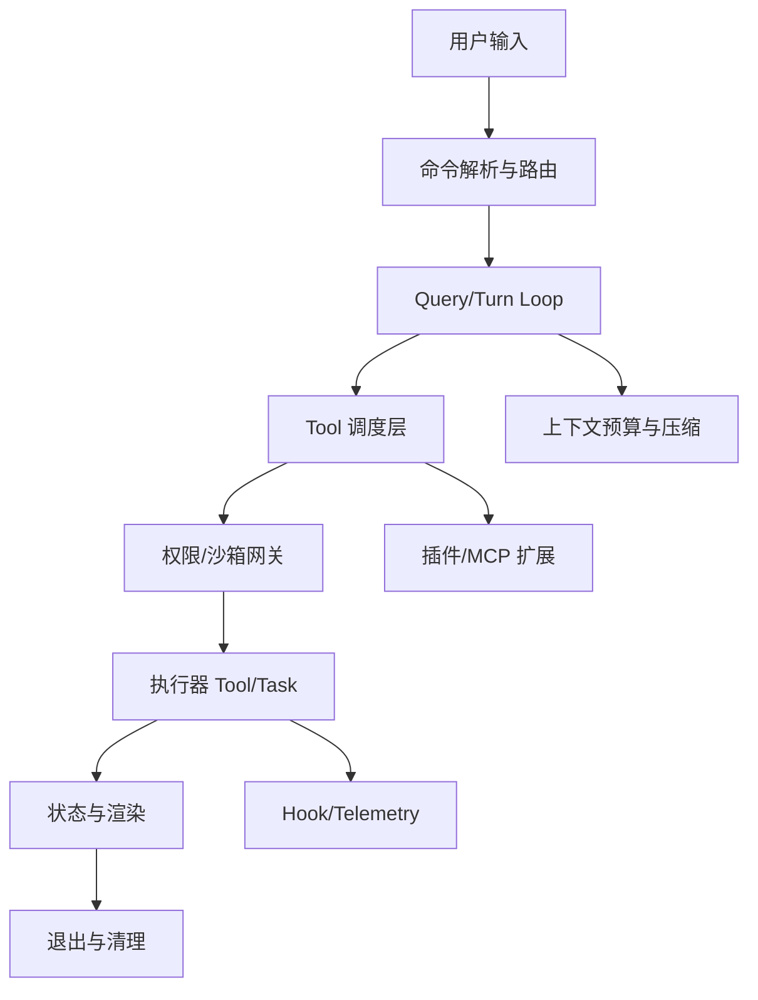

# 14. 最值得复用的 10 个工程模式（含可直接套用模板）

## 目标
从 Claude Code `src/` 中抽取“可迁移到你自己 CLI/Agent 系统”的高价值工程模式。每条模式都包含：
- 在本仓库中的落点（证据文件）
- 适用场景与边界
- 可直接改造的 TypeScript 模板

## 模式总览图


## 1) 能力注册中心（Registry First）
**仓库落点**
- `src/tools.ts`
- `src/tasks.ts`
- `src/commands.ts`

**核心思想**
把“系统有哪些能力”集中在注册层声明，运行时通过过滤策略（feature flag、权限、preset、环境）决定暴露集合，而不是在业务分支里 scattered if-else。

**适用场景**
- 能力数量持续增长
- 不同运行模式（simple/repl/coordinator）能力集不同

**模板**
```ts
// capability-registry.ts
export type Capability = {
  name: string
  enabled: (ctx: RuntimeContext) => boolean
  execute: (input: unknown, ctx: RuntimeContext) => Promise<unknown>
}

export function resolveCapabilities(all: Capability[], ctx: RuntimeContext) {
  return all.filter(c => c.enabled(ctx))
}
```

## 2) 编排层与执行层分离（Orchestration vs Execution）
**仓库落点**
- `src/services/tools/toolOrchestration.ts`
- `src/services/tools/toolExecution.ts`

**核心思想**
编排层负责分组/并发/顺序；执行层只负责“单次调用”的权限、hook、错误归一。这样并发策略变化不影响工具具体实现。

**模板**
```ts
// orchestrator.ts
export async function runBatch(calls: ToolCall[], ctx: Ctx) {
  const [parallel, serial] = partition(calls, c => c.concurrencySafe)
  const p = Promise.all(parallel.map(c => runSingle(c, ctx)))
  const s: ToolResult[] = []
  for (const c of serial) s.push(await runSingle(c, ctx))
  return [...(await p), ...s]
}

// executor.ts
export async function runSingle(call: ToolCall, ctx: Ctx): Promise<ToolResult> {
  await assertPermission(call, ctx)
  await beforeHook(call, ctx)
  try {
    const output = await call.execute(call.input, ctx)
    await afterHook(call, output, ctx)
    return { ok: true, output }
  } catch (error) {
    return normalizeToolError(error)
  }
}
```

## 3) 强类型运行时上下文（Typed Runtime Context）
**仓库落点**
- `src/Tool.ts`（`ToolUseContext`）
- `src/Task.ts`（task 上下文）

**核心思想**
把“运行时系统能力”通过单一 context 显式传递（state、abort、ui、telemetry、cache），避免全局单例污染。

**模板**
```ts
export interface RuntimeContext {
  abortSignal: AbortSignal
  setUIStatus: (msg: string) => void
  readState: <T>(k: string) => T
  writeState: (k: string, v: unknown) => void
  emitMetric: (name: string, data?: Record<string, unknown>) => void
}

export type ToolFn<I, O> = (input: I, ctx: RuntimeContext) => Promise<O>
```

## 4) 权限与策略前置网关（Policy Gate Before Side Effects）
**仓库落点**
- `src/utils/permissions/permissionSetup.ts`
- `src/utils/permissions/permissions.ts`
- `src/services/tools/toolExecution.ts`

**核心思想**
在产生副作用前统一判定策略（allow/deny/ask），并把审批 UI 与执行逻辑解耦。

**模板**
```ts
type Decision = 'allow' | 'deny' | 'ask'

type PolicyEngine = {
  decide: (action: Action, ctx: RuntimeContext) => Promise<Decision>
}

export async function guardedExec(action: Action, exec: () => Promise<unknown>, policy: PolicyEngine) {
  const d = await policy.decide(action, {} as RuntimeContext)
  if (d === 'deny') throw new Error('Permission denied')
  if (d === 'ask') {
    const approved = await requestUserApproval(action)
    if (!approved) throw new Error('User rejected')
  }
  return exec()
}
```

## 5) 并发安全声明式化（Declarative Concurrency Safety）
**仓库落点**
- `src/Tool.ts`（`isConcurrencySafe`）
- `src/services/tools/toolOrchestration.ts`

**核心思想**
由工具自己声明并发安全条件，编排器只消费声明。比“中央硬编码某工具可并发”更可维护。

**模板**
```ts
export interface Tool<I, O> {
  name: string
  isConcurrencySafe?: (input: I) => boolean
  run: (input: I, ctx: RuntimeContext) => Promise<O>
}

export function isParallelizable<I>(tool: Tool<I, unknown>, input: I): boolean {
  return tool.isConcurrencySafe ? tool.isConcurrencySafe(input) : false
}
```

## 6) 输出与状态串行化队列（Deterministic Queue）
**仓库落点**
- `src/utils/messageQueueManager.ts`

**核心思想**
并发发生时，UI 输出/消息入列仍然按可预期顺序提交，避免“回包乱序导致用户误判状态”。

**模板**
```ts
export class AsyncQueue {
  private tail = Promise.resolve()

  enqueue<T>(job: () => Promise<T>): Promise<T> {
    const run = this.tail.then(job, job)
    this.tail = run.then(() => undefined, () => undefined)
    return run
  }
}
```

## 7) 上下文预算器 + 压缩流水线（Budget + Compaction）
**仓库落点**
- `src/query/tokenBudget.ts`
- `src/services/compact/compact.ts`
- `src/services/compact/autoCompact.ts`
- `src/services/compact/microCompact.ts`

**核心思想**
先预算，再执行；超预算时触发分层压缩策略，而不是等 API 报错再补救。

**模板**
```ts
export async function preparePrompt(input: PromptInput, budget: number): Promise<PromptInput> {
  const used = estimateTokens(input)
  if (used <= budget) return input

  const micro = microCompact(input)
  if (estimateTokens(micro) <= budget) return micro

  return fullCompact(micro)
}
```

## 8) 扩展生态“主流程无侵入”（Plugin/MCP Boundary）
**仓库落点**
- `src/services/mcp/client.ts`
- `src/services/mcp/config.ts`
- `src/utils/plugins/pluginLoader.ts`
- `src/utils/plugins/loadPluginCommands.ts`
- `src/skills/loadSkillsDir.ts`

**核心思想**
通过统一适配层把外部能力折叠成内部 Tool/Command 契约，主循环不需要知道扩展实现细节。

**模板**
```ts
export interface ExternalProvider {
  listTools(): Promise<ExternalToolMeta[]>
  invoke(name: string, payload: unknown): Promise<unknown>
}

export function adaptProvider(p: ExternalProvider): Tool<any, any>[] {
  // 将外部协议映射为内部 Tool 接口
  return []
}
```

## 9) Hook 中间件化（Cross-cutting as Hooks）
**仓库落点**
- `src/hooks.ts`
- `src/services/tools/toolExecution.ts`

**核心思想**
把 telemetry、审计、通知等横切能力做成 hook，不让业务执行函数承担这些职责。

**模板**
```ts
type HookCtx = { action: string; startedAt: number }

type Hooks = {
  before?: (ctx: HookCtx) => Promise<void>
  after?: (ctx: HookCtx, output: unknown) => Promise<void>
  onError?: (ctx: HookCtx, err: unknown) => Promise<void>
}

export async function withHooks<T>(action: string, run: () => Promise<T>, hooks: Hooks): Promise<T> {
  const ctx = { action, startedAt: Date.now() }
  await hooks.before?.(ctx)
  try {
    const out = await run()
    await hooks.after?.(ctx, out)
    return out
  } catch (e) {
    await hooks.onError?.(ctx, e)
    throw e
  }
}
```

## 10) 生命周期清理注册表（Centralized Cleanup Registry）
**仓库落点**
- `src/utils/cleanupRegistry.ts`
- `src/utils/gracefulShutdown.ts`

**核心思想**
所有可释放资源（socket、watcher、tmp session）统一注册，退出时统一回收，降低泄漏风险。

**模板**
```ts
export class CleanupRegistry {
  private cleaners: Array<() => Promise<void> | void> = []

  register(cleaner: () => Promise<void> | void) {
    this.cleaners.push(cleaner)
  }

  async runAll() {
    for (const cleaner of this.cleaners.reverse()) {
      try { await cleaner() } catch {}
    }
  }
}
```

## 推荐落地顺序（给你自己的 CLI）
1. 先做 `模式 1 + 2 + 3`（能力清单、编排/执行分离、context 契约）。
2. 再做 `模式 4 + 5 + 6`（权限门控、并发声明、输出队列稳定性）。
3. 最后做 `模式 7 + 8 + 9 + 10`（预算压缩、扩展生态、横切 hook、退出清理）。

## 反模式提醒
- 反模式 A：在工具函数里直接做 UI、权限、telemetry、网络重试，导致函数不可测。
- 反模式 B：把所有扩展逻辑写进主循环，后续每新增一个 provider 都要改核心流程。
- 反模式 C：不做 budget 预估，靠报错驱动压缩，用户体验不稳定。
- 反模式 D：并发策略硬编码在调度器，工具作者无法声明副作用边界。

## 证据文件索引
- `src/tools.ts`
- `src/tasks.ts`
- `src/commands.ts`
- `src/Tool.ts`
- `src/Task.ts`
- `src/services/tools/toolOrchestration.ts`
- `src/services/tools/toolExecution.ts`
- `src/query/tokenBudget.ts`
- `src/services/compact/compact.ts`
- `src/services/compact/autoCompact.ts`
- `src/services/compact/microCompact.ts`
- `src/utils/messageQueueManager.ts`
- `src/utils/permissions/permissionSetup.ts`
- `src/utils/permissions/permissions.ts`
- `src/services/mcp/client.ts`
- `src/services/mcp/config.ts`
- `src/utils/plugins/pluginLoader.ts`
- `src/utils/plugins/loadPluginCommands.ts`
- `src/skills/loadSkillsDir.ts`
- `src/hooks.ts`
- `src/utils/cleanupRegistry.ts`
- `src/utils/gracefulShutdown.ts`
